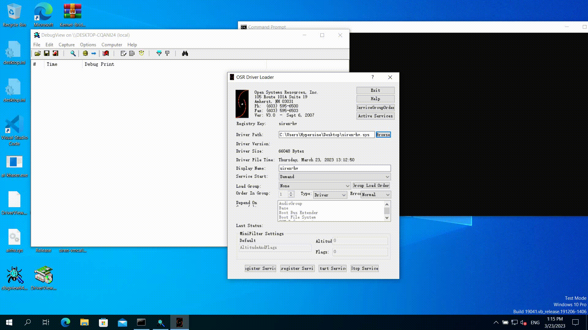

# siren-hypervisor

A runnable Type-2 hypervisor for Windows guest machine powered by Hyper-V.

So far:

1. Only `CPUID` instruction is hooked/intercepted.

2. EPT uses identity map.

3. No MSRs are hooked/intercepted. They are all forwarded to upper hypervisor.

## Screen Recording

